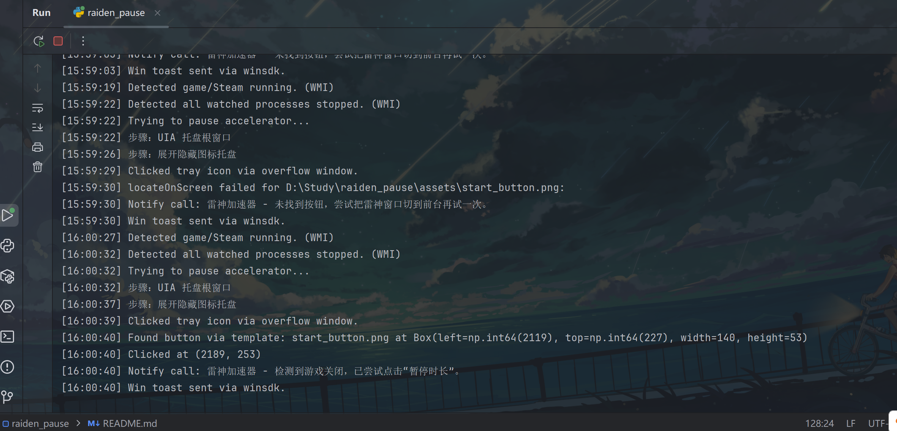
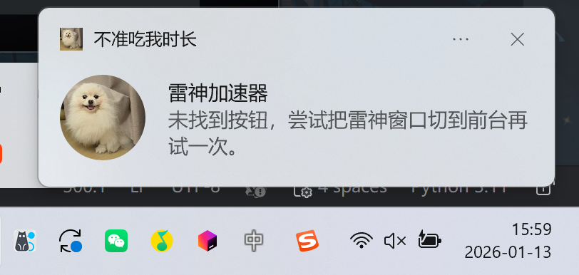

# 雷神加速器自动暂停脚本

检测游戏/Steam 进程退出后，自动提示并尝试点击雷神加速器的“暂停/开启时长”按钮，减少无效时长消耗。

## 快速开始

- 免安装版：解压 `dist/raiden_pause-win64.zip` → 双击 `raiden_pause.exe`（与 `_internal` 同级）→ SmartScreen 点“更多信息/仍要运行”。
- 源码运行：安装 Python 3.9+ → `pip install -r requirements.txt` → `python raiden_pause.py`（在项目根目录，确保能找到 `assets/`）。

## 环境要求

- 平台：Windows 10/11 桌面。
- Python：3.9+（仅源码运行需要）。
- 依赖：`psutil pyautogui pillow opencv-python win10toast pywin32 pywinauto wmi winsdk`（`winsdk` 不可用时自动回退 win10toast 通知）。
- 显示设置：建议系统缩放 100%，雷神窗口放在主屏，避免遮挡。

## 资源文件

- 必需模板：`assets/start_button.png`（加速中/红色“暂停时长”），`assets/unstart_button.png`（已暂停/灰色“开启时长”）。
- 通知图标：`assets/logo.ico`、`assets/logo.png`（WinRT 优先 PNG）。
- 将 `assets/` 与程序/脚本放在同一目录层级，确保可被找到。

## 运行步骤

### 免安装版（raiden_pause-win64.zip）
1. 在 `dist/` 找到压缩包，右键“全部提取/解压”，解压到桌面或任意空文件夹。
2. 保持解压后的 `raiden_pause.exe` 与 `_internal` 文件夹同级，不要单独拷贝 exe。
3. 双击 `raiden_pause.exe` 运行；若 SmartScreen 拦截，点“更多信息”→“仍要运行”。
4. 需要快捷方式：右键 exe → “发送到” → “桌面快捷方式”。
5. 无反应/被拦截：尝试右键“以管理员身份运行”或暂时关闭安全软件后再试。

### 源码运行
1. 安装依赖：`python -m pip install -r requirements.txt`（或指定 Python 路径）。
2. 运行脚本（确保当前目录有 `assets/`）：  
   `python raiden_pause.py`  
   示例：`D:\Python\Python311\python.exe D:\Study\raiden_pause\raiden_pause.py`
3. 可按需添加开机自启或随 Steam 启动。

## 配置项速查（`raiden_pause.py` 顶部）

- `WINDOW_TITLE_KEYWORDS`：雷神窗口标题关键字。
- `RAIDEN_PROCESS_NAME`：雷神主进程名，用于恢复窗口。
- `BUTTON_CENTER_REL` / `BUTTON_REGION_HALF`：按钮相对窗口左上角的位置与匹配区域。
- `WATCH_PROCESSES`：需要监听的进程名（小写）。
- `POLL_INTERVAL`：轮询间隔；`WMI_TIMEOUT_MS`、`WMI_ERROR_LIMIT`：WMI 等待与回退阈值。
- `TOAST_APP_ID`：通知显示名；`MATCH_CONFIDENCE`：模板匹配阈值。

## 工作原理（简版）

监听目标进程（WMI 优先，异常回退轮询） → 全部退出时尝试从托盘恢复雷神窗口 → 在固定区域截图匹配“暂停时长”按钮 → 点击 → Windows 通知提示结果。

## 常见问题 / 排错

- OpenCV/依赖缺失：用实际运行的 Python 安装依赖，例如 `D:\Python\Python311\python.exe -m pip install opencv-python`。
- 找不到按钮/识别偏差：确认雷神窗口可见且未被遮挡，模板与当前界面一致；系统缩放设为 100%，窗口放主屏。
- 无点击动作：检查安全软件/权限；可尝试以管理员身份运行。
- 多显示器：优先把雷神窗口放在主屏。
- 通知仍显示 Python：安装 `winsdk`；不可用时会回退 win10toast。
- SmartScreen 拦截：点“更多信息”→“仍要运行”。
- 进程未被监听：核对 `WATCH_PROCESSES` 与实际 exe 名（小写）。

## 更新记录

- 进程监听改为 WMI 事件驱动，异常时自动回退轮询，降低 CPU 占用。
- 通知改用 Windows SDK（winsdk）发送，支持自定义应用名与图标；不可用时回退 win10toast。
- 新增 AppUserModelID 注册与开始菜单快捷方式，确保通知左上角显示“不准吃我时长--v1.0”与自定义图标。
- 新增通知图标资源：`assets/logo.ico` / `assets/logo.png`。
- 依赖新增 `winsdk`（`winrt` 在 Python 3.11 上无可用发行版，因此改用 winsdk）。

## 截图

