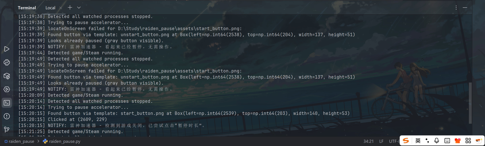
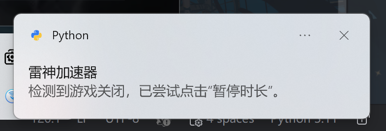
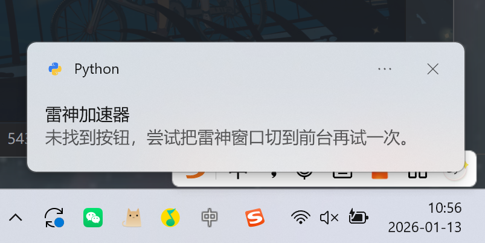

# 雷神加速器自动暂停脚本

检测游戏/Steam 进程退出后，自动提示并尝试点击雷神加速器的“暂停/开启时长”按钮，减少无效时长消耗。

## 功能概览

- 监听 Steam / EA / 多款游戏进程
- 进程全部退出时触发自动暂停流程
- 优先从托盘恢复雷神窗口并定位按钮
- 使用固定区域截图匹配“暂停时长”按钮并点击
- Windows 通知提示执行结果

## 环境要求

- 仅支持 Windows 10/11（依赖 Win32 API 与桌面截图）
- Python 3.9+（建议 3.11）

依赖：

```
pip install psutil pyautogui pillow opencv-python win10toast pywin32 pywinauto wmi
```

> 记得要在本地安装这些依赖，如： D:\Python\Python311\python.exe -m pip install win10toast

## 资源文件

将按钮模板放到 `assets/`：

- `assets/start_button.png`：加速中（红色“暂停时长”）
- `assets/unstart_button.png`：已暂停（灰色“开启时长”）

可按需补充全屏截图用于调试（非必需）。

## 运行方式

推荐在项目目录执行（确保能找到 `assets/`）：

```
python raiden_pause.py
```

```cmd
D:\Python\Python311\python.exe D:\Study\raiden_pause\raiden_pause.py
```

建议加入开机自启或随 Steam 启动。

## 配置说明

在 `raiden_pause.py` 顶部可调整：

- `WINDOW_TITLE_KEYWORDS`：雷神窗口标题关键字
- `RAIDEN_PROCESS_NAME`：雷神主进程名（用于进程恢复窗口）
- `BUTTON_CENTER_REL`：按钮相对窗口左上角坐标
- `BUTTON_REGION_HALF`：固定匹配区域半宽/半高
- `WATCH_PROCESSES`：需要监听的进程名（小写）
- `POLL_INTERVAL`：轮询间隔（秒）
- `WMI_TIMEOUT_MS`：WMI 事件等待超时（毫秒）
- `WMI_ERROR_LIMIT`：WMI 连续错误阈值（超过后回退到轮询）
- `MATCH_CONFIDENCE`：模板匹配阈值

## 使用方法

1. 先打开雷神加速器，并保持正常登录
2. 启动 Steam / 游戏
3. 游戏结束退出后，脚本会尝试自动暂停
4. 如果识别失败，会弹出通知提醒手动暂停

快速开始：

```
D:\Python\Python311\python.exe -m pip install -r D:\Study\raiden_pause\requirements.txt
D:\Python\Python311\python.exe D:\Study\raiden_pause\raiden_pause.py
```

提示：`assets/` 目录需要放置 `start_button.png` 与 `unstart_button.png` 模板图。

## 原理说明

- 优先使用 WMI 事件监听进程创建/退出（更省 CPU）
- WMI 不可用或连续报错会自动回退到定时轮询
- 当全部目标进程退出时，先尝试从托盘恢复雷神窗口
- 以窗口左上角为基准，固定区域进行截图匹配
- 匹配到“暂停时长”按钮后点击

## 使用流程（V1）

1. 游戏/Steam 进程退出
2. 弹出通知提醒
3. 尝试从托盘恢复雷神窗口
4. 固定区域截图识别并点击“暂停时长”
5. 二次通知提示结果

## 常见问题与排错

- 提示 OpenCV 未安装：请用脚本实际运行的 Python 安装依赖，例如：
```
D:\Python\Python311\python.exe -m pip install opencv-python
D:\Python\Python311\python.exe -c "import cv2; print(cv2.__version__)"
```
- 点击是通过截图吗？是。雷神界面为自绘控件，UIA 找不到按钮，因此采用固定区域截图匹配。
- 从最小化/托盘如何恢复到前台？通过 pywinauto 点击托盘图标（含“显示隐藏的图标”），必要时用 pywin32 进程恢复窗口。
- 找不到按钮：确认雷神窗口可见且未被遮挡；模板截图与当前按钮一致（颜色/字体/分辨率）。
- 识别不准：建议系统显示缩放设为 100%，否则模板匹配容易偏差。
- 多显示器：尽量把雷神窗口放在主屏幕，再尝试。
- 没有点击动作：检查是否有安全软件/权限拦截；可尝试以普通用户权限运行。
- 一直不触发：确认 `WATCH_PROCESSES` 中的进程名与实际 exe 一致（小写）。
- WMI 报错或无效：请先安装 `wmi`/`pywin32`，仍异常会自动回退到轮询。

## 调试工具

托盘与坐标相关脚本放在 `test/` 目录下，可用于排查托盘按钮与坐标定位。

## 已知限制

- 需要用户首次提供按钮模板截图
- 按钮样式变化会影响识别
- 多显示器支持计划在 2.0 版本加入


## 截图



